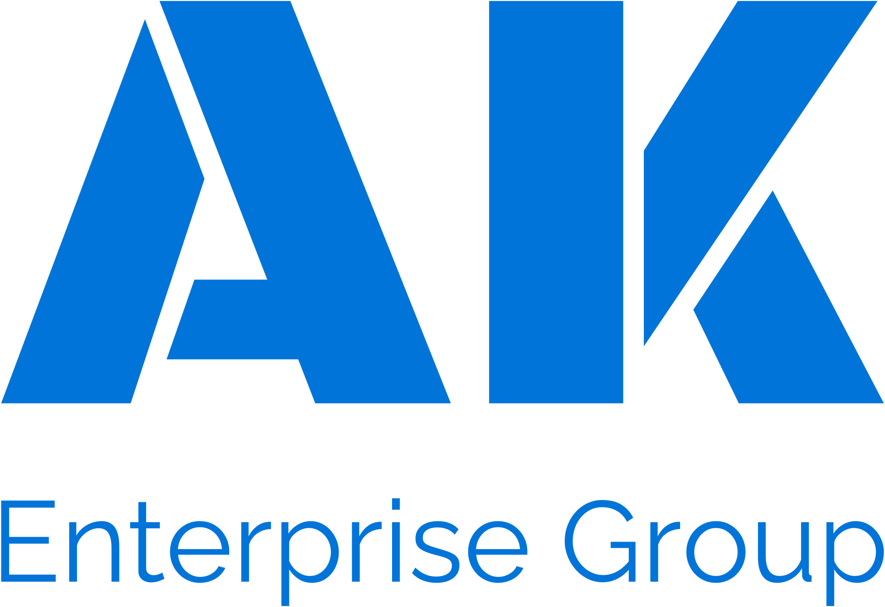

# AK Books

<div align="center">
  
</div>

<p align="center">
  <strong>Integrated Financials & Operations Suite</strong><br />
  Tailored for Site Management, Construction, and Service Enterprises.
</p>

<p align="center">
  <a href="https://akenterprisegroup.in">
    
  </a>
  
  
</p>

---

## 📘 Overview

**AK Books** is an all-in-one business management platform designed to unify high-fidelity financial accounting with rugged operational site management. Built with a "Zoho-First" UX philosophy, it bridges the gap between field activity (site work, workforce tracking, scrap disposal) and the back-office (invoicing, payments, financial reporting).

## 🚀 Core Features

### 🏦 Financial Management (The "Books" Core)
- **High-Fidelity Invoicing**: Professional invoice generation with multi-template support (PDF).
- **Payment Tracking**: Record partial and full payments, manage overdue balances.
- **Quotation Pipeline**: Convert accepted bids directly into active invoices.
- **Expense Breakdown**: Real-time tracking of site overheads and operational costs.

### 🏗️ Operations & Site Management
- **Project Tracking**: Manage active jobs, site shifting, and dismantling operations.
- **Labour & Workforce**: Track workforce presence and daily site activity.
- **Locker & Maintenance**: Specialized modules for secure locker handling and maintenance.
- **Scrap Activity**: Integrated ledger for scrap inventory and disposal management.

### 📊 Business Intelligence
- **Sales Overview**: Visual insights into revenue performance and client distribution.
- **Profit & Loss Tracking**: Compare monthly income against operation expenses.
- **Client Database**: Centralized directory for clients and branch-level contacts.

---

## 🛠️ Technology Stack

- **Framework**: [Next.js](https://nextjs.org/) (App Router & Server Actions)
- **Database**: [PostgreSQL (Neon)](https://neon.tech/) with [Drizzle ORM](https://orm.drizzle.team/)
- **Styling**: Tailwind CSS & [shadcn/ui](https://ui.shadcn.com/)
- **Icons**: [Lucide React](https://lucide.dev/)
- **Charts**: [Recharts](https://recharts.org/)
- **Reports**: [React-PDF](https://react-pdf.org/) & [jspdf](https://github.com/parallax/jsPDF)

---

## 🛠️ Getting Started

### 1. Prerequisites
- Node.js 18+
- A Neon PostgreSQL Database URL

### 2. Installation
```bash
git clone https://github.com/anas-khan/ak-books.git
cd ak-books
npm install
```

### 3. Environment Setup
Create a `.env` file in the root:
```env
DATABASE_URL=your_neon_postgres_url
```

### 4. Database Migration
```bash
npm run db:push
```

### 5. Start Development
```bash
npm run dev
```

Open [http://localhost:3000](http://localhost:3000) to access the AK Books dashboard.

---

<p align="center">
  Built with ❤️ by <strong>Anas Khan</strong> for <strong>AK Enterprise Group</strong>.
</p>
